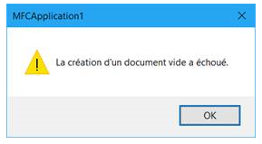

# mfc-simple-sample

The is a very simple MFC sample which can be used to make an issue with some
updates of Windows 10 visible.

On some machines, the sample does not work when pressing `Ctrl+O` (nothing happens)
and `Ctrl+N` displays an error message.

